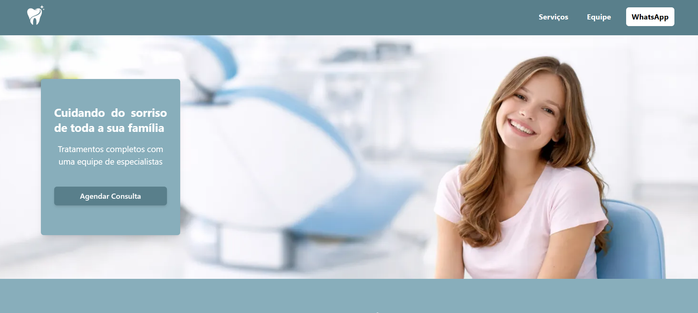

# 🦷 Clínica Odontológica | Website Profissional


---

## 🔗 Acesse o projeto

👉 https://clinica-odontologica-indol-nine.vercel.app/

---

## 📸 Preview

> *Adicione aqui um print do seu projeto depois 👇*

```id="preview"

```

---

## ✨ Sobre o projeto

Este projeto é um website moderno para uma clínica odontológica, desenvolvido com foco em:

* Experiência do usuário (UX)
* Interface limpa e profissional
* Responsividade completa
* Performance e boas práticas

Ideal para apresentação de serviços, equipe profissional e depoimentos de pacientes.

---

## 🚀 Tecnologias

* ⚛️ **React / Next.js**
* 🟦  **TypeScript**
* 🎨 **Tailwind CSS**
* 💫 **AOS (Animate On Scroll)**
* 🌐 **API externa (Random User)**

---

## 📁 Estrutura do projeto

```id="estrutura"
├── app
│   ├── globals.css
│   ├── layout.tsx
│   └── page.tsx
│
├── _components
│   ├── AosInit.jsx
│   ├── CardDepoimentos.tsx
│   ├── CardEquipe.tsx
│   ├── CardServicos.tsx
│   ├── Diferenciais.tsx
│   ├── Footer.tsx
│   ├── Header.tsx
│   └── Home.tsx
│
├── data
│   ├── diferenciais.ts
│   ├── equipe.ts
│   ├── servicos.ts
│   └── textosDepoimentos.ts
│
├── public
├── lib
├── types
│   ├──depoimentos.ts
│   ├── diferenciaisTipagem.ts
│   ├── service.ts
│   └── equipetipagem.ts
```

---

## ⚙️ Funcionalidades

✔️ Layout responsivo (mobile-first)
✔️ Carrossel de serviços e depoimentos
✔️ Consumo de API para imagens dinâmicas
✔️ Animações suaves com AOS
✔️ Componentização com React
✔️ Botão de contato via WhatsApp

---

## 🌐 API utilizada

Para simular pacientes reais nos depoimentos:

```id="api"
https://randomuser.me/api/
```

---

## 🧠 Diferenciais técnicos

* Uso de **useEffect** para responsividade dinâmica
* Carrossel customizado (sem biblioteca externa)
* Separação de dados (`/data`) e tipos (`/types`)
* Estrutura organizada seguindo boas práticas do Next.js

---

## 🛠️ Como rodar o projeto

```bash id="run"
# Clone o repositório
git clone https://github.com/seu-usuario/seu-repo.git

# Acesse a pasta
cd seu-repo

# Instale as dependências
npm install

# Rode o projeto
npm run dev
```

Abra no navegador:

```
http://localhost:3000
```

---

## 📌 Melhorias futuras

* 🔐 Área administrativa
* 📅 Sistema de agendamento real
* ⭐ Avaliações com nota (estrelas)
* 🌍 SEO avançado
* 🚀 Deploy otimizado

---

## 👩‍💻 Desenvolvedora

**Gabriely Schiller**
Front-end Developer

💡 Apaixonada por criar interfaces modernas, responsivas e funcionais.

---

## 📄 Licença

MIT License
